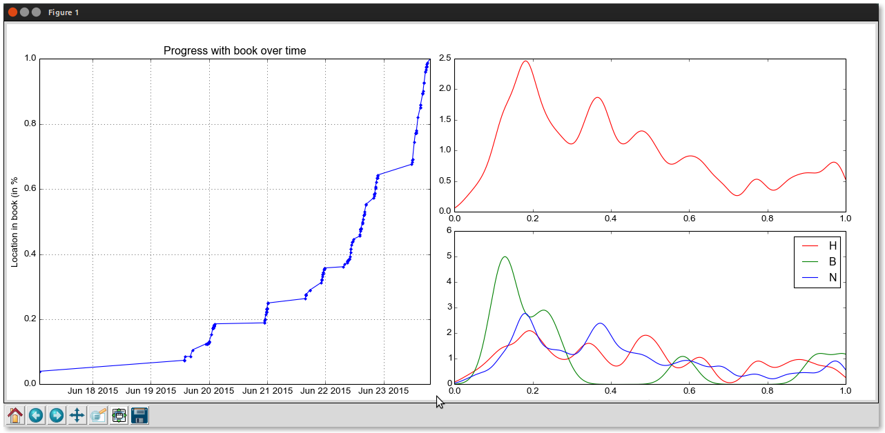

### What are these files?

These are simple scripts that get your clippings from your Kindle, and show some statistics based on your notes, bookmarks and highlights. The current python script gives you three graphs:

* A graph showing your progress with the book (progress vs time)
* Spread of highlights, bookmarks and notes throughout your book
* Individual spreads of highlights, bookmarks and notes.

### Assumptions

I wrote these scripts so that I can view book progress from my kindle on my computer. I would have loved to have this feature on the kindle itself, and I'm not a very big fan of jail breaking my machine, so I settled on writing these scripts. So before you use these scripts, here are the assumptions I am making:

* You use a kindle.
* You periodically take notes, highlight stuff or leave bookmarks as you read a book. *This is important* as the the graphing utility uses the locations of these markers and then uses their time stamps to graph stuff.
* You use linux.

If the assumptions don't apply to to you, here are things you can do:

* If you don't use a kindle:
    * Write a similar script for your device and add your files to this repo.

* If you don't take notes/highlights/bookmarks and still want to use the feature:
    * as you are reading a book, periodically add bookmarks. If you are unsure about where to put the bookmarks, put them whenever you begin a chapter.

* If you don't use Linux, you should.

And yes, it is stated in the LICENSE file, but I should reiterate, "If you blow stuff up, you blow stuff up. I am not responsible" (though the probability of that happening is very low.)

### Basis Usage

<ol>
<li>
Clone the repo:
```Shell
~ $ git clone https://github.com/abhikpal/ebook_utils.git
```
</li>

<li>
Chnage to the directory contining the files.
```Shell
~ $ cd ebook_utils
```
</li>

<li>
Connect your Kindle and run the `get_clippings.sh` script.
```Shell
~/ebook_utils $ chmod +x get_clippings.sh
~/ebook_utils $ ./get_clippings.sh
```
</li>

<li>
Edit the end of the python file (`book_progress.py`) to add the book you want to get the statistics for.
```python
if __name__ == '__main__':
    ## Enter your book name here:
    plot_book_stats('book name here')
```
</li>

<li>
To get a list of books that you can get information for, run python in interactive mode, import the file into it and run `get_book_list()`
```Shell
~/ebook_utils $ python
```
and then inside the python interpreter:
```python
>>> from book_progress import *
>>> get_book_list() # This will give you a list of all the books you have information about.
```
</li>

<li>
Run the python file.
```Shell
~/ebook_utils $ python book_progress.py
```
</li>

<li>
If the universe decides to cooperate with you, you should see a window similar to the one shown below.

</li>
</ol>


### Requirements

* The python scripts requires the `pylab` and `scipy` libraries.
* The current version has a shell script that works on Linux machines. I guess it would work on Mac machines too but I've never tried.

### Contribute

If you think this project is something fun to work on, fork this repo and submit pull requests. Writing some documentation would also be a good idea. My brain malfunctions at times, so if you find typos correct them!

If you want to contribute but don't know how to use GitHub, you can reach me at `abhikp@muwci.net`